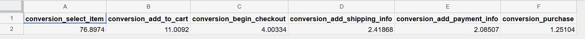
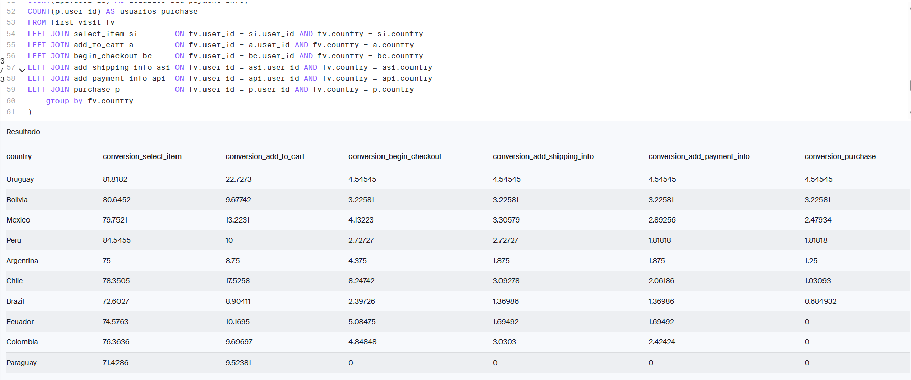
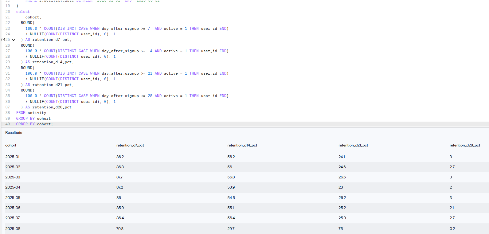
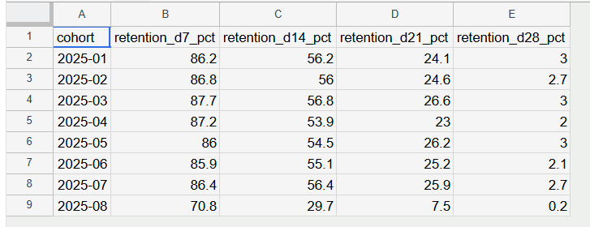
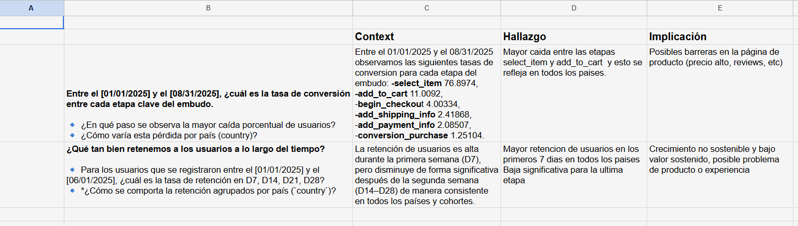

# Análisis de Embudo y Retención para Mercado Libre
##🎯PROBLEMA 

Como analista de producto dentro del equipo de Crecimiento y Retención, el objetivo era identificar en qué etapas del proceso de compra los usuarios abandonan la plataforma y evaluar qué tan efectivas son las estrategias de retención.

## PREGUNTAS A RESPONDER

**¿En qué etapa se pierden más usuarios?**
 Entre el [01/01/2025] y el [08/31/2025], ¿cuál es la tasa de conversión entre cada etapa clave del embudo?.
🔹 ¿En qué paso se observa la mayor caída porcentual de usuarios?
🔹 ¿Cómo varía esta pérdida por país (country)?
**¿Qué tan bien retenemos a los usuarios a lo largo del tiempo?**
🔹 Para los usuarios que se registraron entre el [01/01/2025] y el [06/01/2025], ¿cuál es la tasa de retención en D7, D14, D21, D28?
🔹 ¿Cómo se comporta la retención por país (country)?

## ⚙️METODOLOGIA

El proyecto fue desarrollado utilizando SQL para analizar el recorrido completo del usuario y construir métricas de crecimiento y retención.

### 🔄 Construcción del embudo de conversión

Se analizaron los eventos generados por los usuarios desde su primera visita hasta la compra final:

● First Visit  ●Select Item   ●Add to Cart   ●Begin Checkout   ●Add Shipping Info   ●Add Payment Info   ●Purchase

El análisis permitió medir la conversión entre cada etapa y detectar los principales puntos de abandono.

### 📉 Identificación de puntos de fuga
Se calcularon tasas de conversión entre cada paso del recorrido para detectar dónde se concentraban las mayores pérdidas.
Además, se segmentaron resultados por:
●País   ●Dispositivo   ●Fuente de tráfico

### 🌎 Segmentación de comportamiento
Se comparó el desempeño del funnel entre distintos mercados y canales de adquisición para identificar oportunidades de optimización.

### 👥Análisis de retención por cohortes
Se construyeron cohortes de usuarios basadas en la fecha de registro para medir la permanencia en la plataforma ademas de segmentacion por pais.
Se evaluaron métricas de retención en:
●D7  ●D14  ●D21  ●D28

### 📊Generación de insights

Los resultados permitieron identificar oportunidades de mejora tanto en el proceso de compra como en la experiencia posterior al registro.

## 📈 RESULTADOS PARA EL NEGOCIO

El análisis permitió obtener una visión completa del comportamiento de los usuarios dentro de la plataforma, identificando las etapas con mayor abandono y los patrones de retención más relevantes.

Principales aportes:

Identificación del mayor punto de fuga dentro del proceso de compra.
Comparación del desempeño por país
Medición de retención mediante cohortes temporales.
Generación de recomendaciones para optimizar conversión y crecimiento.

## 🛠️HERRAMIENTAS UTILIZADAS
●SQL  ●Common Table Expressions (CTEs)  ●Window Functions  ●Funnel Analysis  ●Cohort Analysis ●Product Analytics  ●Data Visualization

